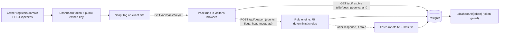

# Signal

**A small business can't easily tell whether search engines and AI answer tools can find, read, and quote its website. Signal checks that from a single script tag and shows the owner a plain report.**

Signal is a Next.js app. A business registers its domain, pastes one `<script>` tag on its site, and every page load sends a small beacon of on-page facts back to Signal. Signal scores those facts against a fixed rule set for SEO (search) and AIO (AI-answer readiness) and shows the result on a private, token-gated dashboard.

> **Status in one line:** a working local prototype with tests and CI. It is not deployed on any client site, it has no users, and several important pieces are still on unmerged branches. Details below.

---

## Goal

Where this is headed:

- Show a business how its visibility in search and AI answers, and how its visitors behave, **change over time**, not just a one-off score.
- Run live on real client sites, with the pack loading on every page and the dashboard updating from real traffic.
- Keep it honest: every number on the dashboard comes from data Signal actually collected. No benchmarks against other sites, no estimated lift, no filler numbers when there's no data.

## Where it stands today

This is an honest snapshot of `main`.

**Works on `main` (locally, covered by unit and e2e tests):**

- Registering a domain (web form at `/` or `POST /api/sites`). This creates a private dashboard token and a separate public embed key.
- Serving the embed pack (`GET /api/pack?key=…`, pack v0.2.1, kept under a 24 KB budget).
- Receiving beacons (`POST /api/beacon`), scoring them with a deterministic rule engine (75 rules across SEO, AIO, performance, accessibility, and best practices), and storing audits and findings in Postgres.
- Reading the site's `robots.txt` and `llms.txt` server-side to see which AI crawlers are allowed. This happens after a beacon when the stored copy is older than 24 hours. There is no scheduled job.
- The token-gated dashboard at `/dashboard/[token]` (see "What the dashboard shows").
- A title/description experiment loop (`GET /api/resolve`). See the caveat below.
- Basic hardening: rate limits, payload size caps, a rule that the page cannot send body text or HTML, refusing outbound fetches to private addresses, security headers, and noindex on dashboard and API routes.
- CI (GitHub Actions) runs lint, typecheck, unit tests (Vitest), and Playwright e2e against Postgres.

**Known problems on `main`** (each one has a fix on an open PR, listed under "In progress"):

- **Cross-origin beacon CORS error.** When the pack runs on a real client domain, the browser logs a CORS error on the beacon response because `Access-Control-Allow-Credentials` is missing. The audit is still stored, but the page shows a console error. Fix: PR #2.
- **Example-page audits overwrite the real site's headline scores.** Opening Signal's built-in example page with a site's key updates that site's headline numbers. Fix: PR #3.
- **Experiments are always on.** On `main` the pack can rewrite a host page's `document.title` and meta description with a generated variant, and there is no per-site off switch. Nobody should embed `main` on a real site until PR #3 (which makes experiments opt-in, off by default) is merged.

**Not built:**

- Visit, contact-action, or real-user speed tracking on `main` (in progress in PR #5).
- Trend views: `main` shows the latest scores and a list of recent audits, not a trend over time (in progress on a branch).
- Any measurement of actual search rankings or AI citations. Signal scores on-page readiness signals. It does not connect to Google Search Console and does not check whether any AI engine actually cites the site.
- Accounts, logins, billing, email reports, or multi-user access. Access is "whoever has the dashboard URL".
- Anything that scales past one server. Rate limits and the crawl-refresh lock live in process memory.

**Not deployed:**

- There is no production deployment config in this repo, and Signal is not running on any client site. The only "real site" testing so far was running the pack against a copy of a real page's HTML in a local Playwright test (described in PRs #2 and #3).

## How it works

In plain terms:

1. The owner registers a domain. Signal gives back a private dashboard link and a public embed snippet.
2. The owner puts the snippet on their site.
3. When someone loads a page, the pack reads facts about the page (title, description, headings, structured data, link and image counts, basic speed timings) and sends only counts, flags, and head metadata. Body text never leaves the page.
4. Signal checks that the beacon came from the registered domain, scores it with the rule engine, and saves the audit and its findings.
5. After responding, Signal refreshes its copy of the site's `robots.txt` / `llms.txt` if it is stale.
6. The owner opens the dashboard link and sees the scores, findings, and crawler access.



## What the dashboard shows (on `main` only)

- Headline **Overall**, **SEO**, and **AIO** scores (0–100) from the latest audit.
- A one-line **AI crawler access** summary: how many answer-time and AI-search agents the site's `robots.txt` allows.
- The **embed snippet**, plus a link to Signal's example page loaded with this site's key.
- **AI readiness breakdown:** five weighted dimensions (crawl 20, structure 25, extractability 25, entity 15, consistency 15). A dimension shows "unknown" when there's no evidence yet instead of a guessed number.
- **AI crawler access table:** 19 known agents (OpenAI, Anthropic, Perplexity, Google, Microsoft, Apple, and others) grouped by role. Training crawlers are listed but don't count toward the score.
- **Experiments:** title/description variants per page, with impressions and engagement rate.
- **Latest findings:** severity, category, rule id, what's wrong, and a suggested fix.
- **Recent audits:** the last 20 audits with timestamp, URL, and scores.

<!-- TODO: add a current screenshot of /dashboard/[token] taken from a local run of main.
     public/signal-token-dashboard.png is from an older version (empty v0.1 state) and doesn't match main. -->

## In progress (not on `main`)

None of this is merged to `main`. Branch and PR state as of this README:

| Work | Where | State |
|---|---|---|
| **Visibility trend tiles:** SEO and AIO score over the last 7 days vs. the 7 days before, with a sparkline; open fixes (latest audit vs. previous); AI crawler access %. Also an optional terrain view behind the `TERRAIN_DASHBOARD` flag. | Branch `feat/terrain-dashboard-phase0`. Tiles came from PR #4 ("Phase 1: client-readable metric tiles + pure catalog (AIO/SEO, Open fixes, Crawl access)") | PR #4 is **merged into the branch, not into `main`** |
| **Visit telemetry:** pack v0.3 sends a visit event (path, referrer host, device class, speed vitals, engagement, contact actions like `mailto:`/`tel:` clicks and form submits), plus a new `POST /api/visit`, daily rollups, and Visits / Contact actions / Speed tiles | PR #5 ("Phase 1: visit telemetry — pack v0.3, visits API, rollups, tiles"), targeting `feat/terrain-dashboard-phase0` | **Open**, not merged |
| **Beacon CORS fix:** send `Access-Control-Allow-Credentials: true` on beacon/resolve responses | PR #2 ("fix: allow credentials on beacon and resolve CORS responses"), targeting `main` | **Open**, not merged |
| **Site-scoped audits + experiments switch:** only audits from the real domain update the headline; experiments become opt-in per site, off by default | PR #3 ("feat: site-scoped audits and a per-site experiments switch"), stacked on PR #2 | **Open**, not merged |

## Tech stack

- Next.js 16 (App Router), React 19, TypeScript
- Tailwind CSS v4
- Postgres 16 with Drizzle ORM and drizzle-kit migrations (`drizzle/0000`–`0003` on `main`)
- Zod for request and payload validation
- Vitest (unit, with happy-dom for the pack runtime test) and Playwright (e2e)
- Bun as package manager and script runner
- GitHub Actions CI

## Local setup

Requirements: Bun 1.3+ and Docker (for Postgres 16).

```bash
docker compose up -d          # Postgres on 127.0.0.1:5433
cp .env.example .env.local
bun install
bun run db:migrate
bun run test
bun run dev                   # http://localhost:3000
```

Then:

1. Open `http://localhost:3000` and register a domain.
2. Save the dashboard link it shows you. The token is only shown once.
3. Open the example page link from the dashboard (`/example-client-page.html?key=…`) to send a beacon.
4. Refresh the dashboard.

Useful scripts: `bun run lint`, `bun run typecheck`, `bun run test`, `bun run test:e2e`, `bun run build`, `bun run db:generate`, `bun run db:studio`.

### Environment variables (names only)

Set in `.env.local` (see `.env.example`):

- `DATABASE_URL`: Postgres connection string (required)
- `APP_ORIGIN`: public origin of the Signal app, used in embed snippets and the CORS allowlist
- `TRUSTED_PROXY_HOPS`: how many proxies in front of Signal to trust for the client IP (unset/0 means trust none)

Used by the e2e setup / CI only: `BASE_URL`, `E2E_PORT`, `CI`.

## Embedding on a host site

The dashboard shows the exact snippet for each site. It looks like this:

```html
<script defer src="https://YOUR_SIGNAL_ORIGIN/api/pack?key=YOUR_PUBLIC_EMBED_KEY"></script>
```

Things to know before putting it on a real site:

- The embed key is public and can't open the dashboard. The dashboard token is private. Don't share it or put it in page source.
- Beacons are only accepted from the registered domain (including `www` and subdomains) or from Signal's own origin (for the example page).
- `APP_ORIGIN` must be set to the public URL the pack is served from.
- **On `main` the pack can change the page's `<title>` and meta description** as part of the experiment loop, and there's a CORS console error on cross-origin pages. Wait for PRs #2 and #3 before embedding on a site you care about.
